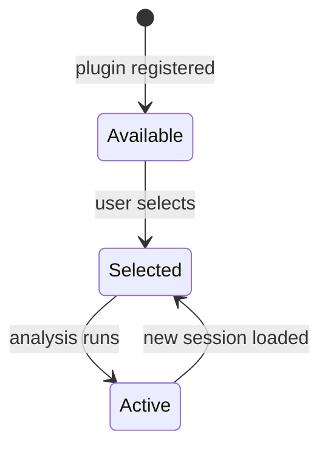

# /spec — Structured Feature Spec

For combinatorial / lifecycle / hardware-critical features, generate a
spec BEFORE writing tests or code. Post it as an issue comment on the
target issue, then wait for review.

`/spec <issue-number>` reads the issue with `gh issue view`, picks the
right format from the table below, and posts the spec for review.

## Format selection

| Feature shape | Spec format | Telltale signs |
|---|---|---|
| Policy / permission logic | **Decision table** | role × state × config combine to decide allow/deny/show/hide |
| Lifecycle / workflow      | **State diagram** (Mermaid) | named states with explicit transitions (create → activate → expire) |
| Hardware / safety-critical | **EARS requirements** | sensors, devices, thresholds, fail-safes, "THE SYSTEM SHALL" |
| Mixed                      | **Combine** | e.g., state diagram for the lifecycle + decision table for permissions inside each state |

If the issue is simple enough that none of the formats add value (plain
CRUD, no combinatorial logic), say so and skip the spec. Not every issue
needs one.

## Decision-table cookbook

- Columns: every input variable that affects the outcome (role, state,
  config flag, tier).
- Output column(s): the result for each combination.
- **Every row is one test case.**
- Include the exhaustive set of meaningful combinations — no implicit
  "and everything else is denied". Mark impossible rows as `n/a` rather
  than omitting them.

## State-diagram cookbook

Use Mermaid `stateDiagram-v2` so it renders in GitHub:

````markdown

````

Name every state and every transition trigger. List guard conditions
below the diagram (e.g., "Selected → Active: only if session has required
data fields").

## EARS cookbook

| Pattern | Template |
|---|---|
| Ubiquitous   | THE SYSTEM SHALL \<action\> |
| Event-driven | WHEN \<trigger\> THE SYSTEM SHALL \<action\> |
| State-driven | WHILE \<state\> THE SYSTEM SHALL \<action\> |
| Conditional  | IF \<condition\> THEN THE SYSTEM SHALL \<action\> |
| Optional     | WHERE \<feature\> IS SUPPORTED THE SYSTEM SHALL \<action\> |

One requirement per line; each independently testable. Use measurable
conditions (thresholds, timeouts, counts), not vague qualifiers
("quickly", "reliably"). Include fail-safe requirements (what happens
when inputs are missing or stale).

## Posting and approval

```bash
gh issue comment <number> --body "$(cat <<'EOF'
## Structured Spec

**Risk tier:** <tier>
**Spec format:** <format>

<spec content>

---
*Generated by /spec. Review and approve before implementation begins.
Each row in a decision table = one test case. Each state transition = one
test case.*
EOF
)"
```

**Do not proceed to TDD until the spec is approved.** If the user
requests changes, update the comment and re-request review.

For features touching federation or data licensing, also read
`docs/federation-design.md` and `docs/data-licensing.md` so the spec is
consistent with existing policy. If the issue was promoted from an IDX
entry, cross-reference the ideation log for design decisions and open
questions.
