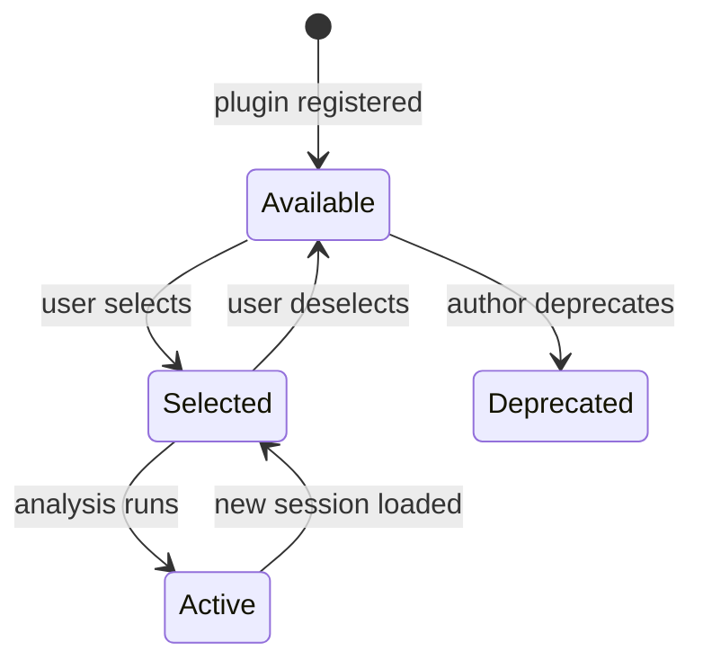

# Structured Feature Spec

Generate a precise, reviewable spec for a GitHub issue before starting TDD.
The spec is posted as an issue comment for human review. No code is written
until the spec is approved.

## Usage

```
/spec <issue-number>
```

## Workflow

### 1. Read the issue

```bash
gh issue view <number> --json title,body,labels
```

Read the issue body carefully. Identify the **feature shape** — the kind of
logic the implementation will need.

### 2. Determine the risk tier

Check which modules the feature will likely touch against the Risk Tiers
table in CLAUDE.md. Report the tier.

### 3. Choose the spec format

Match the format to the feature shape:

| Feature shape | Spec format | Signs you need it |
|---|---|---|
| **Policy / permission logic** | Decision table | Multiple input variables (role, state, config) combine to determine an outcome (allow/deny, show/hide). The issue mentions "rules", "access control", "visibility", "filtering". |
| **Lifecycle / workflow** | State diagram (Mermaid) | An entity moves through named states with explicit transitions. The issue mentions "create", "activate", "expire", "revoke", states, or transitions. |
| **Hardware / safety-critical** | EARS requirements | Behavior depends on real-time conditions with fail-safe requirements. The issue mentions sensors, devices, thresholds, or "THE SYSTEM SHALL". |
| **Mixed** | Combine formats | Complex features may need a state diagram for the lifecycle AND a decision table for the permission logic within each state. |

If the feature is simple enough that a spec adds no value (e.g., a
straightforward CRUD endpoint with no combinatorial logic), say so and skip
the spec. Not every issue needs one.

### 4. Generate the spec

#### Decision Table

Structure as a Markdown table with:
- **Input columns:** Each variable that affects the outcome (role, state,
  config flag, tier, etc.)
- **Output column(s):** The result for each combination (allowed/denied,
  visible/hidden, action taken)
- **Every row is a test case** — the agent can generate one test per row

Example:
```markdown
| User role | Thread visibility | Co-op taggable? | Can @mention? |
|---|---|---|---|
| crew (own boat) | boat-private | n/a | Yes |
| crew (other boat) | boat-private | n/a | No (thread not visible) |
| crew (other boat) | co-op-wide | yes | Yes |
| crew (other boat) | co-op-wide | no | No (opted out) |
| coach | intra-boat (coached) | yes | Yes |
| coach | intra-boat (not coached) | n/a | No (thread not visible) |
```

Guidelines:
- Include the **exhaustive** set of meaningful combinations — don't leave
  implicit "and everything else is denied" rows
- Mark impossible/nonsensical combinations as "n/a" rather than omitting them
- Group rows logically (by role, then by state)

#### State Diagram

Use Mermaid syntax so it renders in GitHub:

````markdown

````

Guidelines:
- Name every state and every transition trigger
- Include error/failure states if they exist
- Add a brief note below the diagram listing any **guard conditions** on
  transitions (e.g., "Selected → Active: only if session has required data
  fields")

#### EARS Requirements

Use the EARS (Easy Approach to Requirements Syntax) patterns:

| Pattern | Template |
|---|---|
| Ubiquitous | THE SYSTEM SHALL \<action\> |
| Event-driven | WHEN \<trigger\> THE SYSTEM SHALL \<action\> |
| State-driven | WHILE \<state\> THE SYSTEM SHALL \<action\> |
| Conditional | IF \<condition\> THEN THE SYSTEM SHALL \<action\> |
| Optional | WHERE \<feature\> IS SUPPORTED THE SYSTEM SHALL \<action\> |

Guidelines:
- One requirement per line — each is independently testable
- Use measurable conditions (thresholds, timeouts, counts), not vague
  qualifiers ("quickly", "reliably")
- Include fail-safe requirements (what happens when inputs are missing or
  stale)

### 5. Post the spec as an issue comment

```bash
gh issue comment <number> --body "$(cat <<'EOF'
## Structured Spec

**Risk tier:** <tier>
**Spec format:** <format>

<spec content>

---

*Generated by `/spec`. Review and approve before implementation begins.
Each row in a decision table = one test case. Each state transition = one
test case.*
EOF
)"
```

### 6. Wait for review

Tell the user the spec is posted and ask them to review it. Do NOT proceed
to TDD until the spec is approved. If the user requests changes, update the
comment and re-request review.

## Tips

- **Read related docs** before generating the spec. For features touching
  federation or data licensing, read `docs/federation-design.md` and/or
  `docs/data-licensing.md` to ensure the spec is consistent with existing
  policy.
- **Cross-reference the ideation log** if the issue was promoted from an
  IDX entry — the ideation log often has design decisions and open questions
  that should be resolved in the spec.
- **Keep it minimal** — the spec captures the combinatorial/lifecycle logic
  that's hard to get right from prose. Don't spec obvious CRUD operations
  or straightforward UI layouts.
- **One spec per issue** — if an issue needs multiple formats (e.g., state
  diagram + decision table), combine them in one comment.
